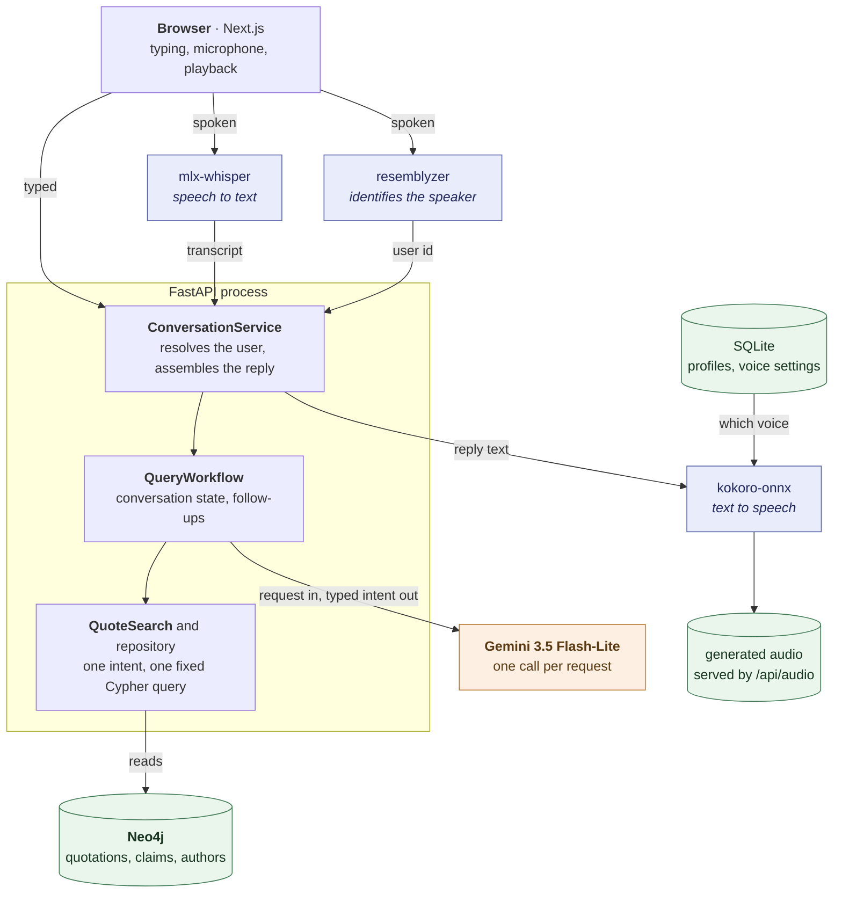
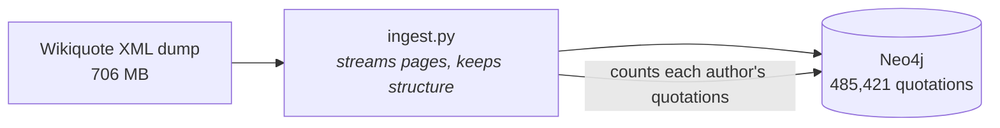
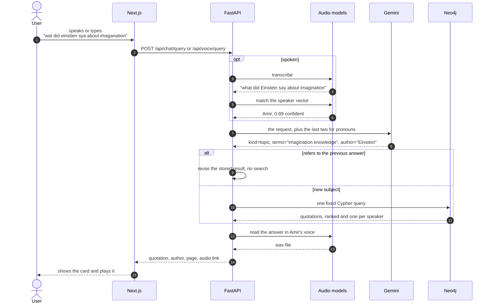
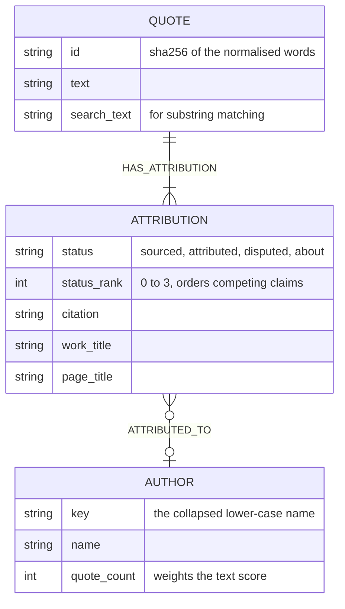

# Which Quote?

Which Quote? searches the English Wikiquote dump by voice or by typing. It
completes a quotation you half remember, finds quotations on a subject, lists
what one person said, and reads the answer back in a voice assigned to whoever
is speaking. It was built for a Natural Language Processing course project.

People do not ask for quotations in the words a quotation uses. They misspell,
they ramble, and a microphone adds its own mistakes. So the application makes
one Gemini call per request, and that call turns what the person said into a
typed search intent: which search to run, the words a matching quotation would
itself contain, and a name if one was mentioned. Everything after that is fixed
Cypher against Neo4j.

Gemini never writes a quotation and never writes a query. Every quote and every
attribution on screen comes out of the graph.

## Architecture



The reply text, the source, and a link to the audio go back to the browser.

Building the graph is a separate pipeline that runs once. Nothing at request
time writes to Neo4j.



## What happens on one request



## How a request is routed

The rewrite returns a `kind`, and each kind has exactly one query behind it.

| kind | when | query |
| --- | --- | --- |
| `topic` | a subject or feeling | full-text over quotation text, terms optional |
| `topic` with a name | "what did Einstein say about imagination" | the same index, then narrowed to that person |
| `author` | "quotes by Virginia Woolf" | full-text over author names, every name part required |
| `quote_fragment` | wording someone half remembers | punctuation-insensitive substring, then full-text if that misses |
| `random` | no subject given | a random attributed quotation the synthesizer can read |
| `repeat`, `alternative`, `attribution` | the request points at the last answer | no query at all, the workflow reuses what it stored |

Autocomplete uses the fragment query directly and never calls Gemini, so typing
costs nothing and returns instantly.

## The graph



The same words can be claimed by different sources, which is why the claim is
its own node: 27,884 quotations carry more than one. `Author` stays a node
because looking up a person is a core query. Work and page titles are only ever
displayed, so they live on the claim instead of becoming two more node types.

## Models and cost

The one model call uses `gemini-3.5-flash-lite`. Google lists it at $0.30 per
million input tokens and $2.50 per million output tokens on the
[pricing page](https://ai.google.dev/gemini-api/docs/pricing).

A rewrite request of 400 input and 50 output tokens costs about $0.000245, so
ten thousand requests cost roughly $2.45. Nothing is charged per quotation,
because the search reads an index the database maintains. Neo4j hosting and
audio compute are not in that figure.

Speech recognition, speaker matching, and synthesis all run locally, so no audio
leaves the machine.

## Requirements

- Python 3.11 or newer
- Node.js 20 or newer
- Neo4j 2026.01 or newer
- a Gemini API key
- the English Wikiquote pages and articles XML dump

Speech recognition uses `mlx-whisper`, which needs Apple Silicon. Speaker
matching uses `resemblyzer` and synthesis uses `kokoro-onnx`. All three are
optional at runtime: `/api/health` reports which are present, and typed search
works without any of them.

## Install

```bash
python3 -m venv .venv
source .venv/bin/activate
python -m pip install -e ".[dev]"

cd frontend
npm ci
cd ..

cp .env.example .env
```

Set at least these values in `.env`:

```dotenv
NEO4J_URI=bolt://127.0.0.1:7687
NEO4J_USERNAME=neo4j
NEO4J_PASSWORD=local-password
GEMINI_API_KEY=...
```

Keep `.env` out of Git and out of any archive you hand in. The application logs
the model name, the intent, token counts, latency, and the fallback reason. It
never logs prompts, audio, keys, or quotation text.

## Build the graph

Start from an empty Neo4j database. Ingestion creates the constraints and
indexes, streams the dump into the graph in batches, and counts each author's
quotations at the end.

```bash
python -m backend.ingest
python -m backend.maintenance verify
```

`verify` prints the current node counts. Search works as soon as the indexes are
online, and there is no separate indexing job to wait for.

For a smaller load while testing:

```bash
PARSE_PAGE_LIMIT=5000 python -m backend.ingest
```

## Run

```bash
uvicorn backend.app:app --reload
```

```bash
cd frontend
npm run dev
```

The API listens on `http://127.0.0.1:8000` and the interface on
`http://127.0.0.1:3000`.

## Enrol a speaker

Registration records at least three samples, averages them into one 256
dimension vector, and assigns an unused Kokoro voice. Recognition compares an
incoming vector against every enrolled one and accepts a match above 0.75.

Record the samples in the room where the system will be used. Measured on two
speakers with a held out sentence, the right speaker scored 0.897 and 0.888
while the two speakers scored 0.578 against each other.

## Test

The suite makes no paid API calls.

```bash
python -m compileall backend
pytest -q

cd frontend
npm test
npm run typecheck
npm run build
```

## Project files

- `backend/app.py`: FastAPI application and routes
- `backend/search.py`: intent routing and the conversation workflow
- `backend/neo4j.py`: graph schema and the fixed queries
- `backend/gemini.py`: the single model call
- `backend/voice.py`: recognition, speaker matching, synthesis
- `backend/users.py`: SQLite profiles and voice settings
- `backend/ingest.py`: the Wikiquote extractor
- `backend/maintenance.py`: graph verification
- `frontend/components/main-shell.tsx`: the text and voice screen
- `REPORT.md`: design and evaluation report

## Contributors

- Amir Hossein Shahdadian
- Mahtab Taheri
- Yasaman Zahedan

See `LICENSE` for licensing information.
